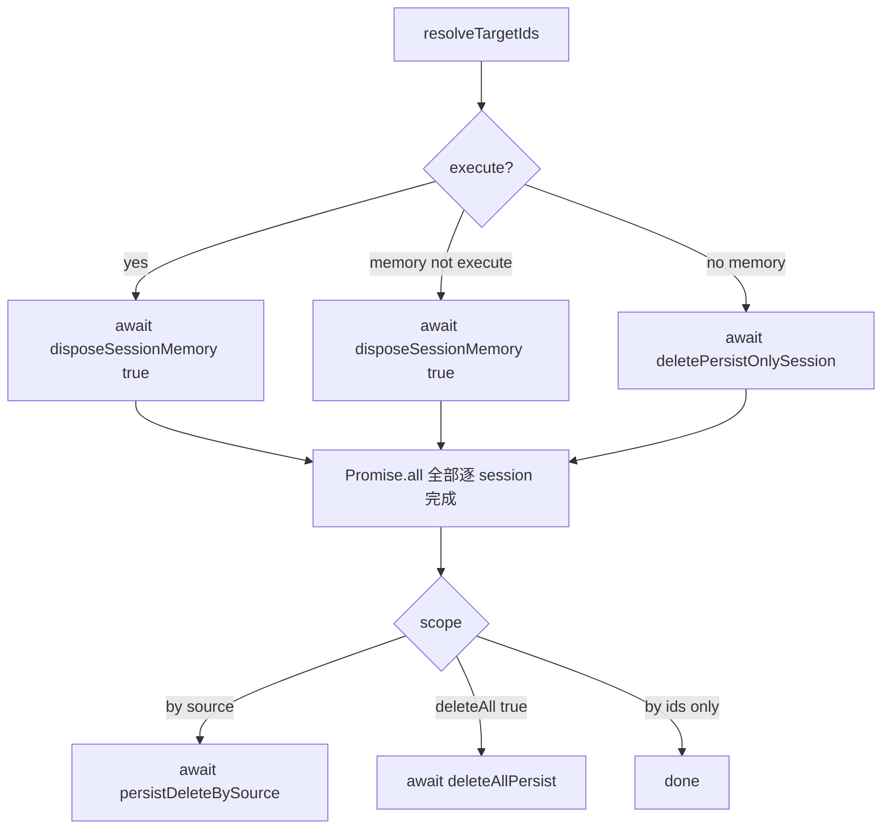

# 重构 deleteSessions：融合停流卸池 + 参数重做

## 新参数结构

全库清删用显式布尔，**不用**「sessionIds / source 都不传」推断：

```ts
export type DeleteSessionsParams = {
  /** 有值：只删这些 id；与 deleteAll / 按 source 互斥语义见下表 */
  sessionIds?: string[]
  /** 有值且非 deleteAll：限定该 source（sessionIds 空时删该 source 下全部） */
  source?: AISource
  /** true：删除所有 session、所有 source（清库）；忽略 sessionIds / source */
  deleteAll?: boolean
}
```

去掉 `sources[]` / `route` / `pageId`。

| 调用形态 | 含义 |
|---------|------|
| `{ sessionIds: [...], source? }` | 按 id 删 |
| `{ sessionIds: [], source: 'ai' }` | 删该 source 下全部 + `persistDeleteBySource` |
| `{ deleteAll: true }` | 全库清删（内存全卸 + `deleteAllPersist`）**不在 HistoryChat 使用** |

优先级：`deleteAll === true` 最高；否则 `sessionIds?.length` 按 id；否则必须带 `source` 做按 source 删。
`sessionIds` 空且无 `source` 且未设 `deleteAll`：视为非法参数，直接 return / 打日志，**不**当作全删。

## 融合 stop 与 dispose（消除竞态）

当前问题：`stopExecutingSessionsAndWait` 只 `forceClose` → `handleSessionEnd` **不 teardown**；随后再 `disposeSessionMemory` 走 `!ready` 捷径卸池。两段之间存在空窗（可重连 / 迟到写），且与「先停后删」语义割裂。

**做法：删除路径不再调用 `stopExecutingSessionsAndWait`。** 执行中的 session 只走增强后的 `disposeSessionMemory`：



### `disposeSessionMemory` 改为 `Promise<void>`

- 注册 `sessionEndWaiters`，再 `pendingDisposeSessions.set(id, deletePersist)` + `forceClose`。
- `handleSessionEnd` 在 `pendingDispose` 时 **`await teardownDisposedSession`**（`deletePersist` 时内部 `await drain` + `await deleteSessionPersist`），**完成后再** `resolveSessionEndWaiters`。这样 `await disposeSessionMemory` 返回时：池已卸、该 session 在飞写已排干、逐条 IDB 删除已结束。
- `!readyChannels`：直接 `await teardownDisposedSession`。
- `deletePersistOnlySession` 同样改为 async 并 await drain+delete。
- `onPageUnload`：可 `void disposeSessionMemory(id, false)`。

### 竞态：`disposeSessionMemory` vs `persistDeleteBySource` / `deleteAllPersist`

当前风险：逐 session 的 `teardown` 里 drain/delete 若 fire-and-forget，扫尾立刻按 source / 清库，可能与未完成的 put/delete 交错。

**硬顺序（必须）：**

1. 先 `await Promise.all` 目标集合内**所有**逐 session 删除（dispose / deletePersistOnly），且每条在 resolve 前已完成 drain + `deleteSessionPersist`。
2. **仅当上述全部结束后**，再：
   - `deleteAll === true` → `await deleteAllPersist()`
   - 否则空 `sessionIds` + 有 `source` → `await persistDeleteBySource(source)`
   - 按 id 删：不做 by-source / 清库扫尾

**写入闸门（配合）：** `pendingDispose` / 删库窗口内，对该 session 的 persist 写 early-return（至少 `deletePersist=true` 时），避免 drain 之后、扫尾之前又 enqueue 新 put。

### `deleteSessions` 分流

1. 解析目标 id：
   - `deleteAll` → `sessionOwnerMap` 全部 id
   - 否则 `sessionIds?.length` → 用传入集合
   - 否则有 `source` → 该 source 下 id
   - 否则非法，return
2. `executingIds = filterExecutingSessionIds(ids)`。
3. **执行中**：`await Promise.all(executingIds.map(id => disposeSessionMemory(id, true)))`。
4. **非执行中**：有内存 → `await disposeSessionMemory(id, true)`；无内存 → `await deletePersistOnlySession(id)`。
5. **屏障后再扫尾**（见上节），禁止与步骤 3/4 并发。

`stopExecutingSessionsAndWait` 可保留给其它「只停不等卸池」场景；**`deleteSessions` 内不再使用**。

## HistoryChat：不做全库清删

[`HistoryChat.tsx`](app/renderer/src/main/src/pages/ai-agent/historyChat/HistoryChat.tsx) **没有**「删光所有 session / 所有 source」入口；`deleteAll: true` 只在 Controller API 预留，**其它位置后续再接**。

HistoryChat 调用约定：

- **清空**：始终 `{ sessionIds: [], source }`（多值 `historyQuerySources` 则按 source 循环），**不传 `deleteAll`**。
- **按天 / 单条**：`{ sessionIds, source }`。
- gRPC `DeleteAll` 与本地 `deleteAll: true` 解耦；前端本地清库不在本页触发。

[`utils.ts`](app/renderer/src/main/src/pages/ai-agent/historyChat/utils.ts) / [`HistoryChatList.tsx`](app/renderer/src/main/src/pages/ai-agent/historyChat/HistoryChatList/HistoryChatList.tsx) 同步新 `DeleteSessionsParams`。

## 持久化预留

[`aiChatPersistStore.ts`](app/renderer/src/main/src/pages/ai-re-act/hooks/persist/aiChatPersistStore.ts) 新增 `deleteAllPersist()`（三表 `clear`），Controller 薄封装；**仅** `deleteAll: true` 时调用。单测可覆盖；HistoryChat 不引用。

## 单测

[`ChatMultiSessionController.pageIndex.test.ts`](app/renderer/src/main/src/pages/ai-re-act/hooks/__test__/ChatMultiSessionController.pageIndex.test.ts)：

- 改新参数签名。
- 执行中删除：只走一轮 cancel，end 后池已卸（融合路径）。
- 非执行 / 孤儿：按现语义直接删。
- 按 source 空 id：`persistDeleteBySource`。
- `{ deleteAll: true }`：`deleteAllPersist`（API 级，非 HistoryChat）。
- 空 id 且无 source 且无 deleteAll：不误走清库。
