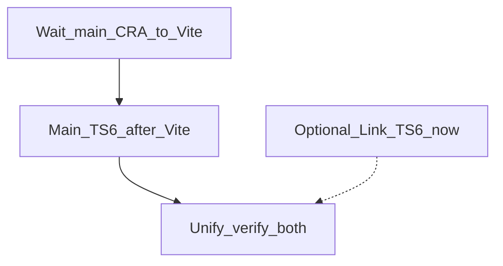

# TypeScript 6 升级执行计划（修订：先 Vite 后 TS）

## 结论

**是的：主渲染端应先完成 CRA→Vite，再升级 TypeScript。**

原因：

- CRA（`react-scripts@5.0.1`）对 TS 的 peer 仍停在 `^3 || ^4`，自带旧 `fork-ts-checker` / `@typescript-eslint@5`，在 CRA 上硬升 TS 6 成本高、收益低
- 与他人并行的 CRA→Vite 会大量改动同一批文件（`package.json`、`tsconfig`、eslint、构建脚本），先升 TS 再迁 Vite 容易双倍冲突与返工
- Vite 落地后主端与 Link 同构：`tsc --noEmit` 做类型检查、esbuild 转译，升 TS 6 路径与 Link 一致，不再需要 CRA resolutions 兜底

## 已锁定决策

- 目标版本：两边统一到 `typescript@~6.0.3`，不上 TS 7 作为主依赖
- **主端 TS 升级排在 CRA→Vite 之后**；本计划不在 CRA 上做 5.1→5.9 中转
- 弃用项直接改掉，不长期依赖 `"ignoreDeprecations": "6.0"`
- 两边 `@typescript-eslint/*` 升到 **8.x**
- 不升级 React / antd / monaco（除非 Vite 迁移本身需要）

## 前置依赖

- 他人负责的 **主渲染端 CRA→Vite** 合并到可开发/可构建状态
- 对接约定：Vite 迁移尽量把主端 TS 停在合理的 5.x（建议直接对齐 Link 的 `~5.9.3`），避免迁完仍停在 5.1.6

## 阶段 A（可选并行）：仅升级 Link

Link 已是 Vite（[engine-link-startup/package.json](app/renderer/engine-link-startup/package.json)），不阻塞主端迁移，可先做：

1. `typescript` → `~6.0.3`
2. `@typescript-eslint/parser` / `eslint-plugin` → `^8.x`
3. 清理 tsconfig 弃用项（见下表）
4. 验收：`yarn build`（含 `tsc --noEmit`）+ eslint

若希望两边一次对齐、减少版本分叉，可跳过本阶段，等主端 Vite 后再一起升。

## 阶段 B：主端 Vite 落地后升级 TS 6

主端已无 `react-scripts` 后执行：

1. `typescript` → `~6.0.3`（若 Vite 迁移已带到 5.9，则直接 5.9→6）
2. 显式依赖 `@typescript-eslint/*@8.x`（不再覆盖 CRA 传递依赖）
3. 按同一套规则清理 tsconfig
4. 验收：主端 Vite dev + 常用 build；eslint 正常

### tsconfig 弃用清理（两边统一规则）

| 项 | 执行 |
|---|---|
| `baseUrl` + `paths` | 删 `baseUrl`；`paths` 改带前缀，如 `"@/*": ["./src/*"]` |
| `moduleResolution: "node"` | app → `bundler`；Node/Vite 配置用 tsconfig → `nodenext` |
| `downlevelIteration` | 删除 |
| `types` 默认变 `[]` | 按需显式列出（如 `node` / 测试相关）；禁止长期 `["*"]` |
| `strict` | 保持各项目现有显式值 |

涉及文件（主端以 Vite 迁移后的实际路径为准）：

- 主端：`package.json`、`tsconfig*.json`、路径别名相关配置、`.eslintrc.cjs`
- Link：[tsconfig.json](app/renderer/engine-link-startup/tsconfig.json)、[tsconfig.app.json](app/renderer/engine-link-startup/tsconfig.app.json)、[tsconfig.node.json](app/renderer/engine-link-startup/tsconfig.node.json)

## 阶段 C：统一验收与收尾

1. 两边 `typescript` 均为 6.0.x；eslint-ts 均为 8.x
2. 无 `ignoreDeprecations`；`types` 已收紧
3. 简短记录：依赖/tsconfig diff、错误数前后、可合并结论

## 明确不做

- 在 CRA 上先做 TS 5.9 / TS 6（避免与 Vite 迁移抢同一批文件）
- TypeScript 7 作为默认主依赖
- 本计划范围内再发起一轮 CRA→Vite（交给正在进行的工作）

## 执行顺序

## 协作建议

- 与 Vite 迁移负责人同步：主端迁完后的目标 TS 建议为 `~5.9.3`，eslint-ts 可暂留或一并到 8（若对方愿意）
- 本计划在 `wait-cra-vite` 完成前，**不改动主端**依赖与 tsconfig，避免 merge 冲突
