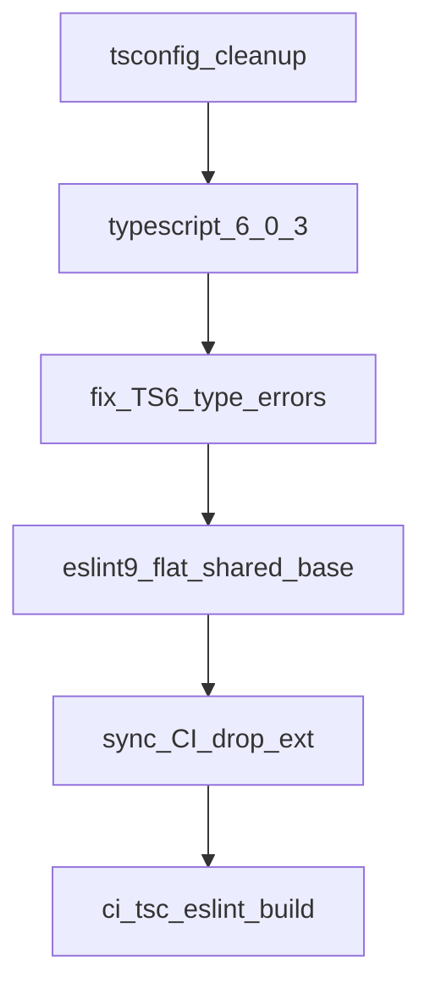

# TypeScript 6 升级执行计划

## 仓库现状（2026-08-13 核对）

本分支 `feat/upgrade-typescript` 目前只有计划文档，**升级代码尚未合入**。此前本地试跑过一轮，改动已丢弃；本计划吸收那次踩坑，不把任何 todo 标成已完成。

| 项 | 主渲染端 `app/renderer/src/main` | Link `engine-link-startup` |
|---|---|---|
| 构建 | Vite 8.2.0 | Vite 8.2.0 |
| `typescript` | `^5.1.6`（仍在 **dependencies**） | `~5.9.3`（devDependencies） |
| ESLint | `^8.57.0` + `@typescript-eslint/*@^7.18.0`，`.eslintrc.cjs` | 同左 |
| 类型检查入口 | `tsc -p tsconfig.json --noEmit`（仅 CI；`build` 不跑 tsc） | `tsc --noEmit && vite build`（build 与 CI 都跑） |
| `moduleResolution` | 已是 `bundler` | app 已是 `bundler`；`tsconfig.node.json` 仍是 **`node`（弃用）** |
| `paths` / `baseUrl` | `paths.json` 已是 `"@/*": ["./src/*"]`，无 `baseUrl` | 仍有 `baseUrl: "."` + `"@/*": ["src/*"]` |
| `downlevelIteration` | 仍为 `true`（TS6 设了就会弃用报错） | 根配置与 `tsconfig.app.json` 均为 `true` |
| `strict` | `true`（显式） | `false`（显式，保持） |

GitHub Actions（[pull-request-test.yml](.github/workflows/pull-request-test.yml)）**已经覆盖两端** tsc/eslint，不是「只查主端」：

- 主端 / Link：`yarn eslint src --ext .js,.jsx,.ts,.tsx`
- 主端 / Link：`yarn tsc -p tsconfig.json --noEmit`

根目录 `ci:tsc` / `ci:eslint` 目前只跑主端，属于本地便捷脚本，与 CI 不完全一致。

主端仍停在 5.1.6，不再做 5.1→5.9 中转；直跳 6.0.3，预留修类型时间。

## 结论

执行顺序改为 **先 Link、后主端**。Link 已是 TS 5.9，升 6.0.3 跨度小，用来验证 tsconfig 弃用清理与 CI 入口是否站得住；主端仍停 5.1.6，本阶段不改。

## 已锁定决策

- 目标：两边 `typescript@~6.0.3`。 **不上 TS 7**：`typescript-eslint@8` 的 peer 是 `typescript >=4.8.4 <6.1.0`，上 7 会装不上或运行期崩。
- 弃用项直接改掉，禁止长期 `"ignoreDeprecations": "6.0"`。
- ESLint：**9.x flat config** + 统一包 `typescript-eslint@8`（替换 `@typescript-eslint/parser` + `eslint-plugin`）。规则严重程度以现有 `.eslintrc.cjs` 为准逐条迁移，**不用** `tseslint.configs.recommended`（会明显严于现状、打爆 CI）。
- 根目录共享 [eslint.config.base.js](eslint.config.base.js) 工厂，两端只留薄包装。Link 有 `"type": "module"`，包装必须是 **`eslint.config.cjs`**（或 `.mjs` + ESM），不能写 `eslint.config.js` + `require`。
- Link 对齐 Vite 官方模板：根 `tsconfig.json` 为 `files: []` + `references`；页面用 `tsconfig.app.json`，Vite 配置用 `tsconfig.node.json`。类型检查必须用 **`tsc -b`**（`yarn type-check`），禁止再对根配置跑 `tsc -p tsconfig.json --noEmit`（会空转）。CI 的 Link tsc job 已改为 `yarn type-check`。
- 主端同样对齐 Vite 模板：根 `tsconfig.json` 为 `files: []` + `references`；`tsconfig.app.json` 检查 `src/`；`tsconfig.node.json` 检查 `vite.config.mts`。类型检查用 `tsc -b`（`yarn type-check`）。
- `strict`、不启 `erasableSyntaxOnly`、不升 React / antd / monaco。不改 `src/alibaba/ali-react-table-dist`（已 exclude，自带 TS ~4.2）。
- 主端 `import type { CancellationToken } from 'typescript'`（如 `yakCompletionSchema.ts`）已确认是 **type-only**，迁到 `devDependencies` 不影响运行时。

## 阶段 1：tsconfig 弃用清理（先于升 TS）

TS6 里只要**写了** `downlevelIteration` / `baseUrl` / `moduleResolution: "node"` 就会弃用报错。先清配置，再升编译器。

| 项 | 执行 |
|---|---|
| `baseUrl` + `paths` | 删 `baseUrl`；`paths` 带 `./` 前缀。主端 `paths.json` 已合规，不动 |
| `moduleResolution: "node"` | app 保持/设为 `bundler`；`tsconfig.node.json` → `module`/`moduleResolution`: `nodenext` |
| `downlevelIteration` | **整键删除**（设 `false` 也会报） |
| `module` | app 改为 `preserve`（与已有 `moduleResolution: "bundler"` 是 TS6 推荐组合） |
| `types` 默认变 `[]` | 禁止 `["*"]`。按报错再显式加：Link node 配置已有 `["node"]`；app 若 Node 全局消失再加 `node`（`vite/client` 已有 `vite-env.d.ts` 的 triple-slash） |
| `noUncheckedSideEffectImports` | TS6 **默认 true**。仓库有 `import 'moment/locale/zh-cn'` 这类 side-effect import，会报 TS2882。本轮显式设 **`false`**，不改业务 import |
| `strict` | 保持现有显式值 |

**Link 三件套（对齐 Vite 官方模板）：**

- [tsconfig.json](app/renderer/engine-link-startup/tsconfig.json)：`files: []` + `references`，只做调度。
- [tsconfig.app.json](app/renderer/engine-link-startup/tsconfig.app.json)：检查 `src/`。
- [tsconfig.node.json](app/renderer/engine-link-startup/tsconfig.node.json)：检查 `vite.config.ts`；`module: nodenext`。
- 命令：`yarn type-check` → `tsc -b`；CI 同步为 `yarn type-check`。

**主端：** [tsconfig.json](app/renderer/src/main/tsconfig.json) 删 `downlevelIteration`，`module` → `preserve`；继续 `extends: ./paths.json`。`vite.config.mts` 不在 `include` 里，本轮不必为它单开 node tsconfig。

## 阶段 2：升级 TypeScript 6.0.3

1. 两端 `typescript` → `~6.0.3`；主端从 `dependencies` 挪到 `devDependencies`。
2. `yarn install`（各自子项目，Yarn 1 classic，三套 `node_modules` 独立）。
3. 跑 tsc，按报错修类型。**主端 5.1.6 → 6.0.3 跨度大于 Link**，错误面以主端为准单独记。

此前试跑已见、本轮预留的修补：

- `Buffer` / `Uint8Array` 在 TS6 下不再互相赋值（如 `WebsocketProvider`）
- 部分 antd/Modal props 推导变严（如 `ShowModalV2Props`）
- `types: []` 导致 `NodeJS.*` / `Buffer` 全局消失 → 按需加 `"types": ["node"]`

只修升级直接暴露的类型错误，不做顺便重构。

## 阶段 3：ESLint 9 flat + typescript-eslint 8

现有 `.eslintrc.cjs` 偏松（`plugin:@typescript-eslint/eslint-recommended`，大量规则 off/warn）。迁移原则：**parity，不借机收紧**。

依赖（渲染端子包 + 根目录共享工厂所需）：

- `eslint@^9`
- `typescript-eslint@^8`（取代 parser/plugin 分包）
- `@eslint/js`、`globals`（ESLint 9 去掉 `env`，必须显式 globals）
- 现有 `eslint-plugin-react`、`eslint-plugin-react-hooks@7.x` 可留

配置形态：

- 根 [eslint.config.base.js](eslint.config.base.js)：CJS 工厂 `createConfig({ extraIgnores })`，`require` 从**根** `node_modules` 解析，因此 `@eslint/js` / `typescript-eslint` / `globals` 等要进**根** `package.json`。
- 主端 `eslint.config.cjs`：薄包装（主端无 `"type": "module"`）。
- Link `eslint.config.cjs`：薄包装（避免 `.js` 被当成 ESM）。
- 删除两端 `.eslintrc.cjs`。

规则对齐要点（不要用 full recommended）：

- 用 `js.configs.recommended` + `tseslint.configs.base` + `tseslint.configs.eslintRecommended` + `react.configs.flat['jsx-runtime']`。
- 把现有 rules 块搬过去，包括已关闭的 `react-hooks` v7 Compiler 规则。
- ESLint 9 recommended **新增**的 `no-constant-binary-expression`：现状不是 error，本轮 **off**，保持迁移前后 parity。
- `react/no-unknown-property`：主端 SVG 用 `pId`，部分资源用 `p-id`，共享配置 **两者都 ignore**（只留 `p-id` 会炸主端）。
- `exhaustive-deps` / `no-useless-escape`：两端旧值不一致。共享后统一为更松的一边（`exhaustive-deps: off`、`no-useless-escape: off`），避免借机把 Link 收紧成 CI 噪音。
- 主端额外 ignore：`src/alibaba/ali-react-table-dist/**`。

## 阶段 4：同步脚本与 CI（漏改会静默空转或直接挂）

ESLint 9 **删除 `--ext`**。当前 CI / 脚本都带 `--ext`，不改必挂。

必须改：

- [.github/workflows/pull-request-test.yml](.github/workflows/pull-request-test.yml) 里 4 个 job 的 `run_command`（主端/Link 的 eslint 与 tsc）
- 根 `ci:eslint` / `ci:tsc`：与 CI 对齐，**覆盖两端**（`run-s` 已有）
- 主端 `lint`；Link 补 `lint` + `type-check`
- Link 各 `build-*`：继续「先类型检查再 vite build」，改为 `yarn type-check && vite build`（`type-check` = `tsc -p tsconfig.json --noEmit`，与 CI 同一入口）

tsc 命令在阶段 1 的策略下可以仍是 `yarn tsc -p tsconfig.json --noEmit`。若有人改回 solution-style，必须把 CI 改成 `yarn type-check` 并保证不是空项目。

## 阶段 5：统一验收

1. 两端 `typescript` 均为 6.0.x；eslint 9 + typescript-eslint 8。
2. 无 `ignoreDeprecations`；`types` 未使用 `["*"]`。
3. 必跑：`yarn ci:tsc`、`yarn ci:eslint`、`yarn build-renders`。dev（`yarn start-renders`）建议抽测，不阻塞合入。
4. 简短记录：依赖/tsconfig/eslint diff、tsc 错误数前后、可合并结论。

## 明确不做

- 本阶段改主端 TS / 升 ESLint（下一阶段再做）
- TypeScript 7 作为默认主依赖
- 借升级收紧 `strict` / 开启 `erasableSyntaxOnly` / 上 `tseslint.configs.recommended`
- 升级 React / antd / monaco
- 改 `ali-react-table-dist`
- 把 Link 根 tsconfig 改成空 `files` + `references` 却继续用 `tsc -p`（会造成类型检查空转；必须用 `tsc -b`）

## 风险与回退

| 风险 | 处理 |
|---|---|
| 主端 5.1→6.0 类型错误面大 | 只修升级暴露的错误；若爆炸再评估是否临时 `ignoreDeprecations`（不作为合入态） |
| ESLint 9 规则变严 | 以旧 `.eslintrc.cjs` 为准；新规则默认 off |
| 共享 ESLint 解析不到包 | 工厂放根目录，共享依赖进根 `package.json`；子包仍保留 `eslint` / `typescript-eslint` 以便 `yarn eslint` |
| CI 仍带 `--ext` 或仍打旧 tsconfig | 阶段 4 与代码同一 PR，禁止拆开 |
