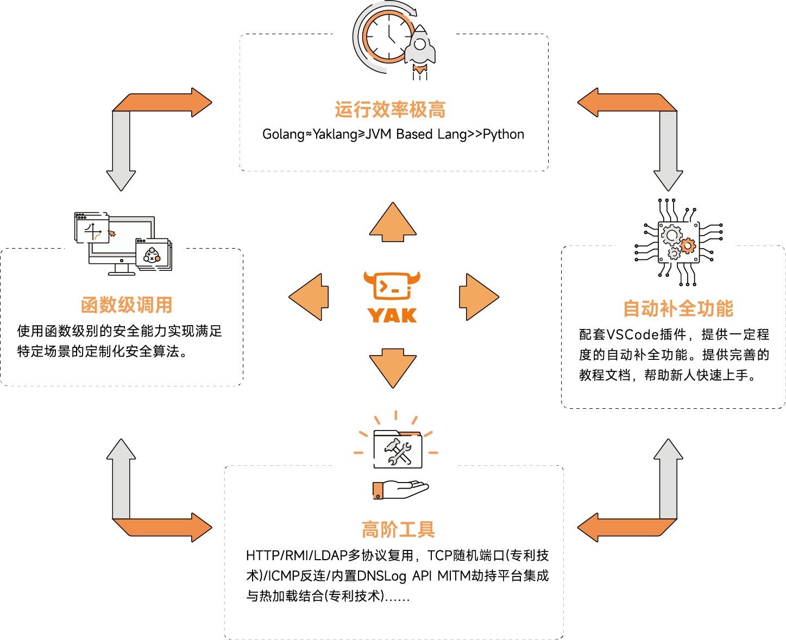
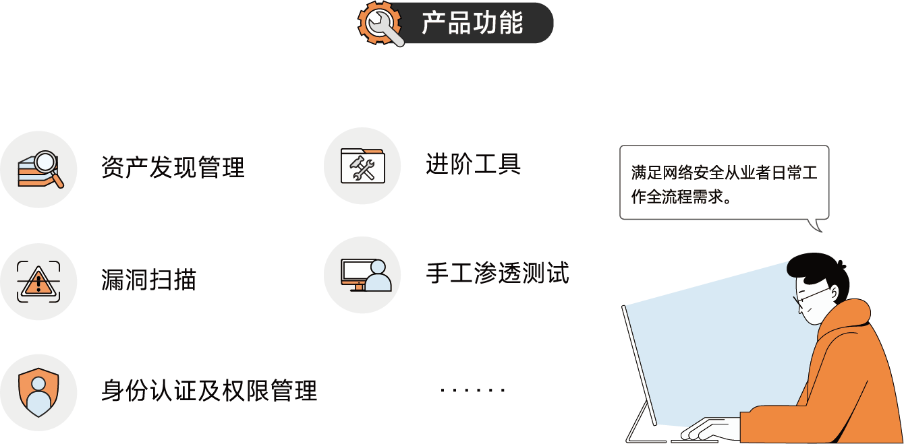
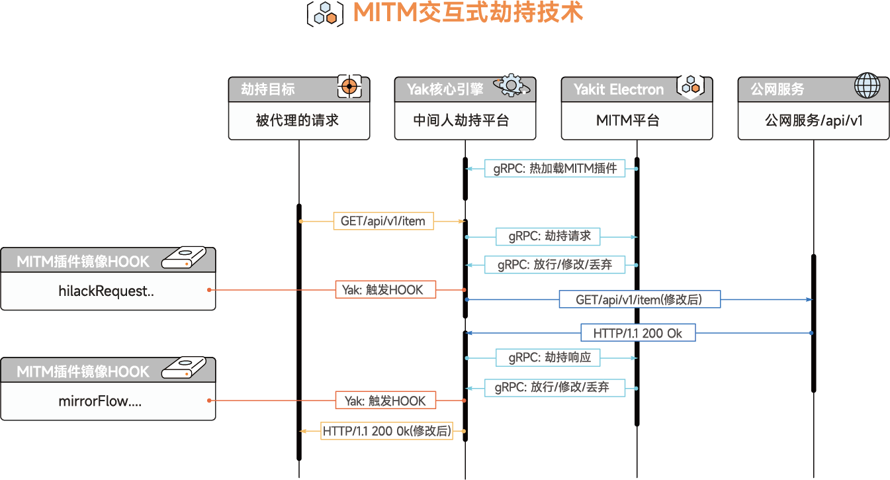
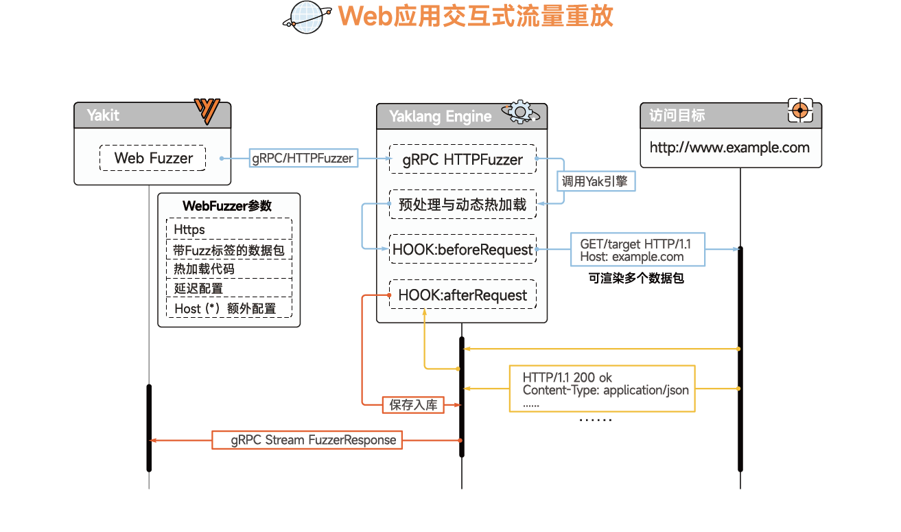
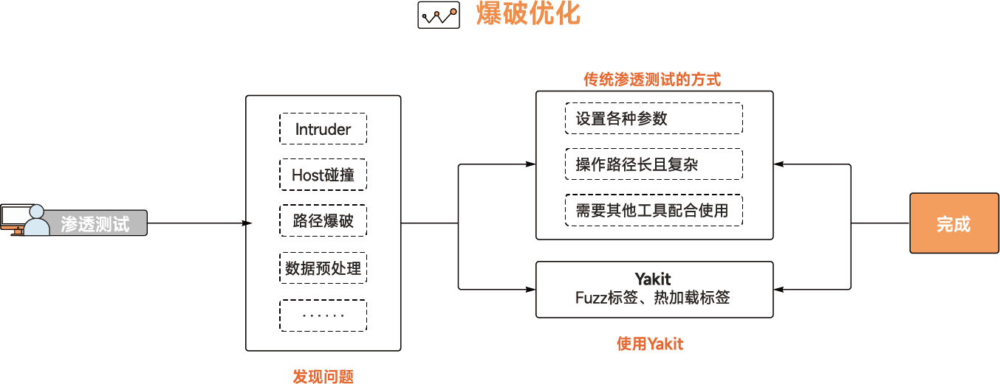
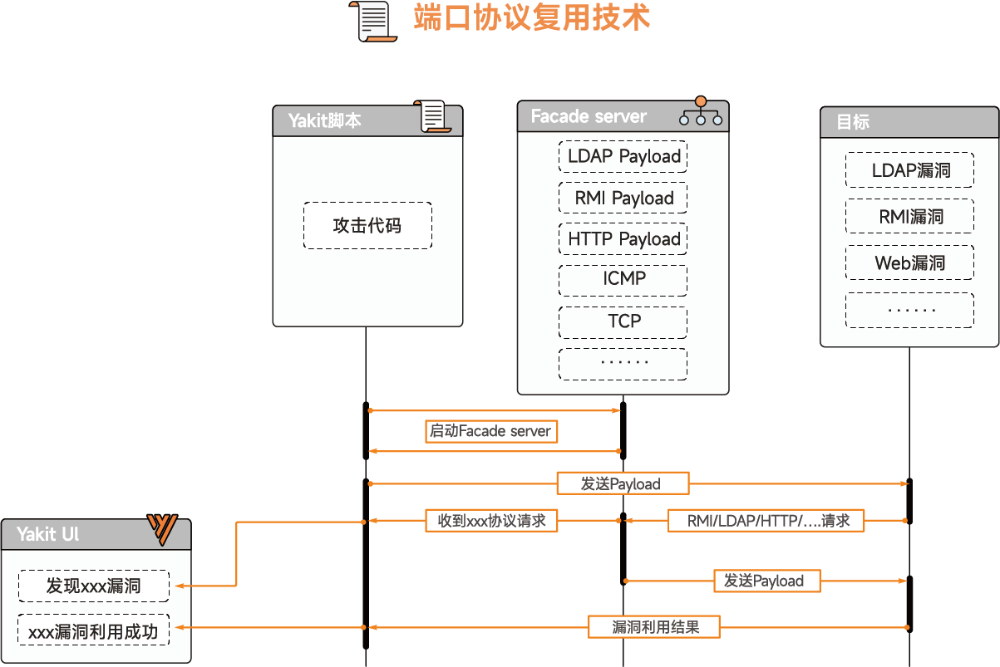

   
 <h2 align="center"> YAKIT-A Cyber Security ALL-IN-ONE Platform based on Yak language</h2>

<a href="https://github.com/yaklang/yakit/releases">
<a href="https://github.com/yaklang/yakkit/graphs/contributors">
<a href="https://github.com/yaklang/yakit/releases/">
<a href="https://github.com/yaklang/yakit/issues">
<a href="https://github.com/yaklang/yakit/discussions">
<a href="https://github.com/yaklang/yakit/blob/main/LICENSE.md">

  <a href="https://yaklang.oss-cn-beijing.aliyuncs.com/yakit-technical-white-paper.pdf">Whitepaper</a> •
  <a href="https://yaklang.io/products/intro/">Official documentation</a> •
  <a href="https://github.com/yaklang/yakit/issues">Issue feedback</a> •
  <a href="https://yaklang.io/">Official website</a> •
  <a href="#Community. ">Community</a> •
  <a href="#Architecture">Architecture</a> 

 :book:Language： <a href="https://github.com/yaklang/yakit/blob/master/README-EN.md">English</a> • 
  <a href="https://github.com/yaklang/yakit/blob/main/README.md">中文</a> 

---
# Introduction

Security integration is a reform of security operations and management for enterprises in the new normal. It is also a top priority for enterprises in the new normal.

Based on the concept of security integration, the Yaklang.io team has developed Yaklang, a vertical language in the security field. For some products/tools that cannot be natively integrated into the Yak platform, Yaklang can be used to rewrite their "high-quality substitutes." For ecologically complete and widely recognized products, Yaklang can directly compile and integrate them, making necessary modifications to the source code for better compatibility with the Yaklang language. For security practitioners who do not want to write code, Yakit provides a suitable GUI for all capabilities in Yaklang. As the versions evolve, the GUI will become more mature.
<h3 align="center">
  </a>
</h3>

In order to make Yaklang's security capabilities more relevant to practical use, we have developed a gRPC server for Yak and built a client called Yakit using this server.

## Architecture

<h3 align="center">
  </a>
</h3>

## Core technologies：CDSL

CDSL, which stands for CyberSecurity Domain Specific Language, is a specialized programming language in the field of cybersecurity. We have developed a stack virtual machine to handle the runtime state of this Turing-complete language. Our aim is to integrate security capabilities and achieve a unified underlying platform through the use of CDSL.

To make our self-developed CDSL language more aligned with practical usage scenarios, we have created a gRPC server for Yaklang. Using this gRPC server as a foundation, we have built the Yakit client.

In practice, Yakit's graphical user interface (GUI) allows users to control the capabilities of the engine. The gRPC server of Yakit enables convenient and efficient deployment options. It is platform-agnostic, providing users with the flexibility to choose between remote deployment or running it directly on their local machines.

<h3 align="center">
  </a>
</h3>

1. It can completely replace BurpSuite as a MITM interception platform.
2. It provides a unique and user-friendly GUI for difficult-to-replicate MITM passive scanning.
3. It allows embedding Yaklang scripts for dynamic debugging of traffic and executing code on the fly.
4. It is the world's first visual Web Fuzzer, a powerful tool for conducting comprehensive web vulnerability testing.
5. Yakit Plugin Store: A marketplace where users can find and install various Yakit plugins.
6. It enables the execution of custom Yaklang scripts or plugins at any step of penetration testing.
   ... ...

Overview of Security Capabilities：

<h3 align="center">
  </a>
</h3>

## Specialized Technologies

### MITM Interactive Hijacking.

The MITM (Man-in-the-Middle) Console in Yakit can fully replace BurpSuite and perform all operations, including downloading and installing certificates, hijacking requests and responses, and editing intercepted packets. It provides a smooth workflow that involves hijacking, history tracking, and using tools like Repeater and Intruder. Users can intercept data, view historical data in the history section, select packets for further analysis, and send them to the Web Fuzzer for Repeater or Intruder operations. In addition to these typical use cases, the MITM module in Yakit offers more flexible features such as plugin-based passive scanning, hot reloading, packet substitution, and tagging.

The underlying principle of Yakit's MITM module is to start an HTTP proxy that automatically forwards traffic. When a user initiates a manual hijack, the automatic forwarding is stopped, and the request is blocked and popped out of the stack. The module then performs tasks such as Gzip decoding, chunk processing, and decoding to make the request human-readable, which is then displayed to the user. Users can view, modify, or replay requests as needed. During replay, the Yakit engine repairs the user-constructed HTTP request to ensure its validity. Yak's engine has a custom-built HTTP library, allowing users to customize malformed requests and responses, which can be useful in exploiting vulnerabilities in specific scenarios.

<h3 align="center">
  </a>
</h3>

### Web Application Interactive Traffic Replay and Fuzz Testing.

The Web Fuzzer module supports user-defined HTTP raw request sending. To make it user-friendly and intuitive, Yakit's backend performs several tasks. It ensures that the necessary information for data transmission and parsing in the HTTP raw request is repaired and completed. For example, Yakit fixes CRLF, completes the Content-Type, handles chunked transfer encoding, adds the missing boundary, corrects the Content-Length, and so on. This allows users to focus on the data-related information without worrying about the underlying intricacies of the HTTP protocol.
<h3 align="center">
  </a>
</h3>

### Fuzztag 

The Web Fuzzer module supports seamless integration of functionalities such as Host collision, Intruder, and directory brute-forcing through Fuzz tags. For example, in a single parameter brute-forcing scenario, let's take the user ID as an example. You can use the {{int(1-10)}} tag to automatically generate a range of IDs for brute-forcing. In scenarios where multiple parameters need to be brute-forced, the Cartesian product of the parameters is used for the brute-forcing. This eliminates the need to select the brute-forcing method and import dictionaries, reducing user operation steps and aligning with user habits compared to BurpSuite's Intruder module.

In addition to generating parameters using tags, the Web Fuzzer module also supports importing external dictionaries. For example: {{file(/tmp/username.txt)}}. In more complex data scenarios, the Web Fuzzer module allows the insertion of hot-loaded tags. For example, if you need to brute-force ID numbers from a specific region, you can directly insert Yak scripts in the Web Fuzzer module to generate the data for brute-forcing. In contrast, BurpSuite's Intruder module would require writing code to generate dictionaries and then importing them into the Intruder module.
<h3 align="center">
</a>
</h3>

>You can refer to the following for more information about Fuzztag： [Fuzztag ](https://yaklang.com/docs/newforyak/fuzztag)

### Reverse Connection Technique and Application Protocol Multiplexing Technique.

Many vulnerability exploitation scenarios require reverse connections to different protocol services. Traditional exploitation tools require setting up separate ports for each service on a public-facing server. For example, in the case of LDAP-based vulnerabilities, one would need to start an HTTP service, an LDAP service, and then send the attack request to complete the exploitation process. Traditional services require unique ports for each service. However, Yaklang's Port Protocol Multiplexing technique allows listening on a single port and identifying the protocol of incoming requests to respond accordingly. The advantage of Yaklang's Port Protocol Multiplexing is not only resource-saving and convenient for manual testing, but also the ability to manually implement various protocols by handcrafting protocol headers. This allows flexible construction of different protocol packets, including the ability to create malformed protocols for vulnerability exploitation or carry data through protocols such as DNS or ICMP, which can be used for backdoor persistence or bypassing certain TCP-based vulnerabilities without going out to the network.

Meanwhile, Yakit implements a reverse connection module based on the Port Protocol Multiplexing technique, which includes features such as Reverse Shell, reverse connection exploitation, and reverse connection detection. The Reverse Shell feature allows listening on a specified port as the receiver for reverse shells. Once a reverse shell is received, it can be used to control the remote server, similar to SSH. In traditional penetration testing scenarios, tools like Nc are used to listen on ports, but they may encounter issues with certain keys like backspace or arrow keys. The reverse shell experience provided by Yakit is similar to native SSH, addressing these limitations. The reverse connection exploitation feature allows setting payloads for different protocols based on a listening port. When a request is received, the protocol is automatically identified, and the corresponding payload is returned to achieve vulnerability exploitation. The reverse connection detection feature provides detection for TCP, DNSLog, and ICMP reverse connections, which can be used for command execution detection.
<h3 align="center">
</a>
</h3>

## How to Use

- You can visit the [official website] (https://yaklang.com/) to download and install Yakit.

- You can refer to our [official documentation的](https://yaklang.io/products/intro/)to learn and use Yakit.

For more technical content, you can check:

[Technical articles](https://yaklang.io/products/article/yakit-technical-study/methodology)

[Whitepaper](https://yaklang.oss-cn-beijing.aliyuncs.com/yakit-technical-white-paper.pdf)

## Community

If you have any constructive feedback or bug reports regarding our product, we welcome everyone to raise an issue.

You can also contact us through our official WeChat account for inquiries or to explore business licensing and partnership opportunities.

If you would like to join our community for discussions or have questions to communicate with our technical team, please contact and add our operations WeChat ID.

<h3 align="left">
  WeChat ID of the staff member:</a>        WeChat official account：</a>
</h3>

## Stargazers over time

## Disclaimer

1. This tool is only for legally authorized enterprise security construction behaviors and personal learning behaviors. If you need to test the usability of this tool, please build a virtual environment by yourself.

2. When using this tool for pentesting, you should ensure that the behavior complies with local laws and regulations and has obtained sufficient authorization. Do not scan unauthorized targets.

3. Reverse engineering, decompiling, attempting to decipher the source code, implanting backdoors to spread malware, etc. on this software are prohibited.

4. If you need to use Yakit for commercial purposes, please ensure that you have obtained official authorization; otherwise, we will hold you accountable for any related responsibilities.

If you have any illegal behavior when using this tool, you shall bear the corresponding consequences by yourself, and we will not bear any legal and joint responsibility.

Before installing and using this tool, please read carefully and fully understand the terms

Unless you have fully read, fully understood and accepted all the terms of this agreement, please do not install and use this tool.Your use behavior or your acceptance of this Agreement in any other express or implied manner shall be deemed to have been read and agreed to be bound by this Agreement

