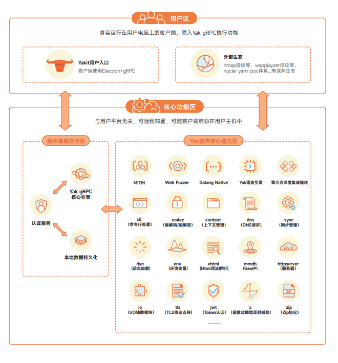
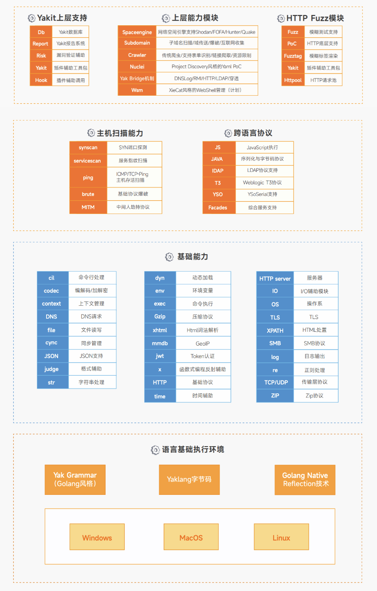
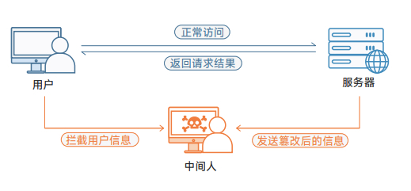
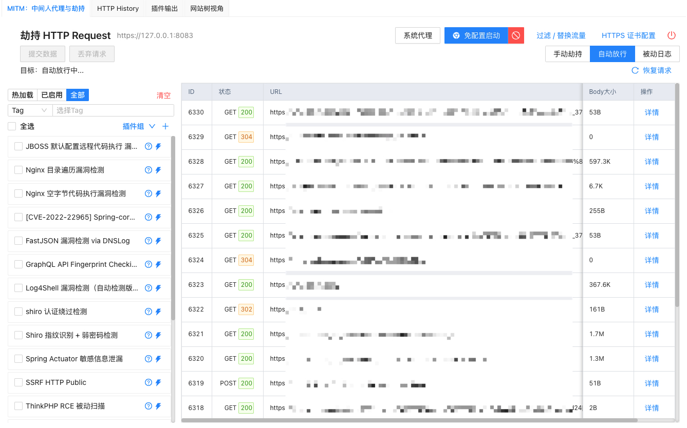
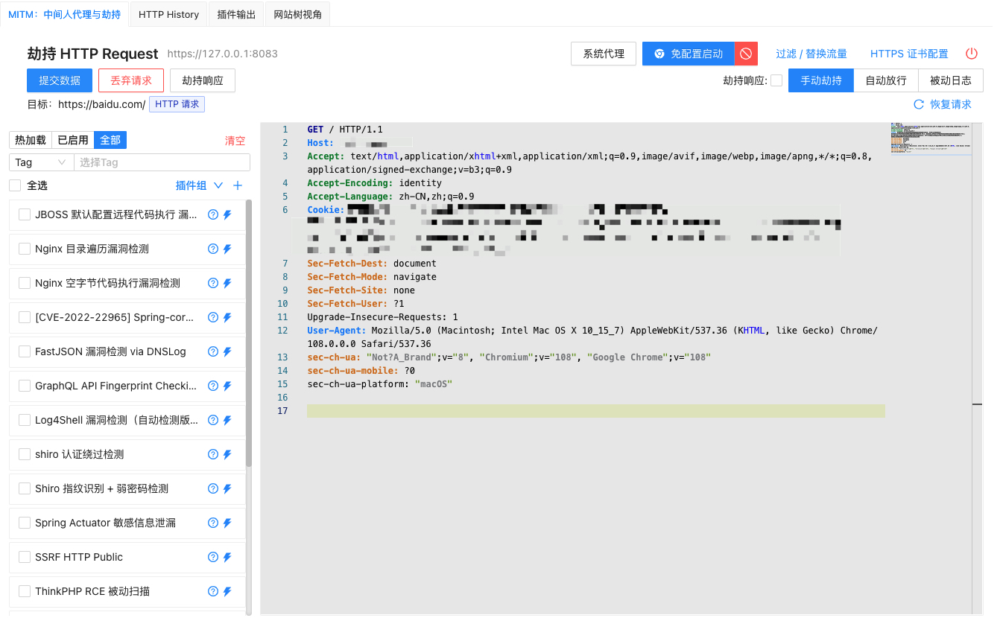
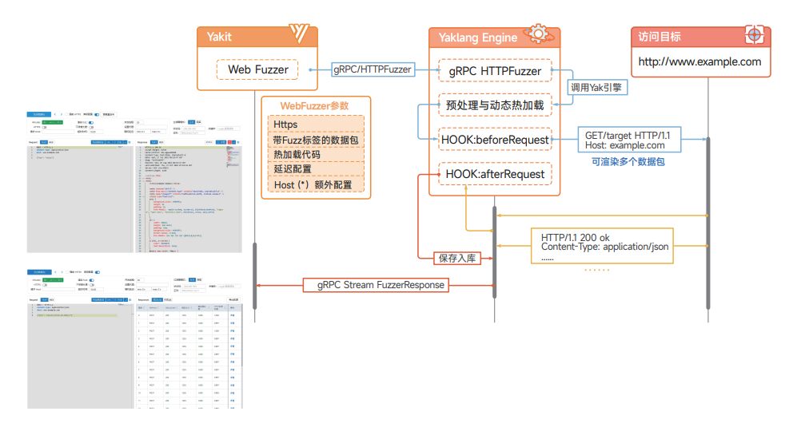

# YAKIT-交互式应用安全测试平台

[进入官网](https://yaklang.com/)

[技术白皮书](https://yaklang.oss-cn-beijing.aliyuncs.com/yakit-technical-white-paper.pdf)

安全融合是新常态下企业的一项安全运营与安全管理的改革，也是新常态下企业的当务之急。

基于安全融合的理念，Yaklang.io团队研发出了安全领域垂直语言Yaklang，对于一些无法原生集成在 Yak平台中的产品/工具，利用Yaklang可以重新编写他们的“高质量替代”。对于一些生态完整且认可度较高的产品，Yaklang能直接编译融合，并对源码进行必要修改，更好地适配Yaklang语言。对于一些不想写代码的安全从业者，Yakit会为Yaklang中所有的能力提供合适的GUI，随着版本更迭，GUI会更加成熟。

为了让Yaklang本身的安全能力更贴近大家的实际使用，我们为Yak编写了gRPC服务器，并使用这个服
务器实现构建了一个客户端：Yakit。

## 项目架构

## 核心技术：CDSL

CDSL 定义为 CyberSecurity Domain Specific Language，网络安全领域的专用编程语言；我们编写了一个栈虚拟机来承载这门图灵完备的语言的运行时状态。我们希望通过 “CDSL” 的手段来实现安全能力的融合和底层平台大统一。

为了让自主研发的安全领域 CDSL 更贴近实际使用场景，我们为 Yaklang 编写了 gRPC 服务器，并基于 gRPC 服务器构建了客户端 Yakit。
实际上就是通过 Yakit 的 GUI 去操控引擎的能力。Yakit 的 gRPC 服务器，让用户部署更加方便快捷，与平台无关，可选择远程部署或直接本地启动在主机中使用。

1. 可百分百替代 BurpSuite 的 MITM 劫持平台；
2. 难以复制的 MITM 被动扫描 GUI；
3. 嵌入 Yaklang 脚本来实现动态调试流量; 随时动态执行代码；
4. 全球第一个可视化的Web模糊测试工具—Web Fuzzer；
5. Yakit插件商店：
6. 可在渗透测试任何步骤内执行自定义的Yaklang脚本或插件

想实现的功能应有尽有。

## 特色技术

### MITM 交互式劫持

MITM 操作台可百分百替代 BurpSuite执行所有操作(下载并安装证书、劫持请求、响应、编辑劫持到的数据包等)。并且提供一整套顺畅的工作流，劫持=>History=>Repeater/Intruder，劫持数据，在History查看历史数据，选择需要“挖掘”的数据包，发送到Web Fuzzer进行Repeater/Intruder操作。除了这些典型的操作场景外，MITM还提供了插件被动扫描、热加载、数据包替换、标记等更灵活的功能。

### Web应用交互式流量重放与模糊测试

Web Fuzzer模块支持用户自定义HTTP原文发送请求。为了让用户使用简单，符合直觉，只需要关心数据相关信息，Yakit后端做了很多工作。HTTP原文中一些保证数据传输和解析的信息都是由Yakit后端修复补全的，例如修复CRLF，补全Content-Type、通过chunk方式传输、补全boundary、修复Content-Length等等。

### Fuzztag 技术

Web Fuzzer模块支持通过Fuzz标签，自然且完美整合了Host碰撞、Intruder、目录爆破等功能。例如单参数爆破场景，以爆破用户id为例，可以使用{{int(1-10)}}标签自动生成爆破的id。面对多个参数爆破的场景，采用笛卡尔乘积的结果作为爆破参数，相较于BurpSuite的Intruder模块，免去了选择爆破方式，导入字典等步骤，极大的减少了用户的操作路径，符合用户使用习惯。当然Web Fuzzer模块除了使用标签自动生成参数，也支持导入外部字典，例：{{file(/tmp/username.txt)}}。面对一些更复杂的数据场景，Web
Fuzzer模块支持插入热加载标签，例如需要爆破某地区的身份证号，可以直接在Web Fuzzer模块插入Yak脚本生成数据进行爆破。而BurpSuite的Intruder模块，面临这种场景，需要编写代码生成字典，再导入Intruder模块。

> [Fuzztag 速览](https://yaklang.com/docs/newforyak/fuzztag)

### 反连技术与应用协议复用技术

许多漏洞利用场景需要用到不同协议服务的反连，传统漏洞利用工具需要在公网服务器为每一个服务监听一个端口，如LDAP类型的漏洞利用，需要启动HTTP服务、LDAP服务，然后发送攻击请求，才能完成一次漏洞利用。传统服务需要为每一个服务分配唯一端口，而Yaklang的端口协议复用技术可以监听一个端口，识别请求的协议，作出相应响应。Yaklang端口协议复用技术优势除了节省系统资源，便于手工测试等外，由于底层原理是手工识别了各种协议头，基于协议标准对各种协议进行手工实现，从而可以灵活的构造各种协议的数据包。例如可以构造一些畸形的协议进行漏洞利用，或通过DNS协议、ICMP协议等携带数据，可以通过这种方式作为后门的权限维持或绕过一些TCP协议不出网情况下的漏洞利用。

与此同时Yakit基于端口协议复用技术实现了反连模块，其中包括Reverse Shell、反连利用、反连检测功能。Reverse Shell可以监听指定端口，作为反弹Shell的接收端，收到反弹Shell后，可以和ssh一样控制远端服务器。传统渗透测试的反连需求中需要使用Nc监听端口，但一些按键如退格键、方向键会有乱码的情况，反弹的Shell使用起来和原生的ssh还有很大区别，而Yakit的Reverse Shell可以做到类似原生ssh的使用体验。反连利用部分可以通过监听一个端口，为不同协议的回连设置Payload，收到请求后便会自动识别请求的协议，返回相应Payload，实现漏洞利用。反连检测功能提供了TCP、DNSLog、ICMP反连的检测，可用于一些命令执行的检测。

## 更多技术信息

[进入官网查看](https://yaklang.com/products/intro/)

[技术白皮书](https://yaklang.oss-cn-beijing.aliyuncs.com/yakit-technical-white-paper.pdf)

## 联系我们

如果对我们的产品有任何建设性意见或 BUG 反馈，欢迎大家提 issue

或通过微信公众号联系我们，也欢迎联系商业授权与合作

进交流群或有问题想与技术同学沟通，请联系并添加运营微信号：

公众号二维码：

## Stargazers over time

[English](https://github.com/yaklang/yakit/blob/master/README-EN.md) • [中文](https://github.com/yaklang/yakit/blob/master/README_LEGACY.md)

## 免责声明

1. 本工具仅面向 **合法授权** 的企业安全建设行为与个人学习行为，如您需要测试本工具的可用性，请自行搭建靶机环境。

2. 在使用本工具进行检测时，您应确保该行为符合当地的法律法规，并且已经取得了足够的授权。请勿对非授权目标进行扫描。

3. 禁止对本软件实施逆向工程、反编译、试图破译源代码，植入后门传播恶意软件等行为。

**如果发现上述禁止行为，我们将保留追究您法律责任的权利。**

如您在使用本工具的过程中存在任何非法行为，您需自行承担相应后果，我们将不承担任何法律及连带责任。

在安装并使用本工具前，请您 **务必审慎阅读、充分理解各条款内容**

限制、免责条款或者其他涉及您重大权益的条款可能会以 **加粗**、加下划线等形式提示您重点注意。

除非您已充分阅读、完全理解并接受本协议所有条款，否则，请您不要安装并使用本工具。您的使用行为或者您以其他任何明示或者默示方式表示接受本协议的，即视为您已阅读并同意本协议的约束。

