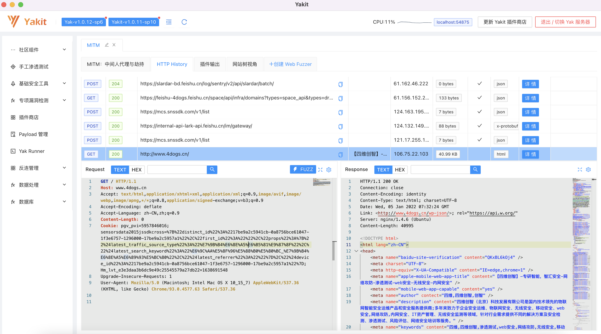
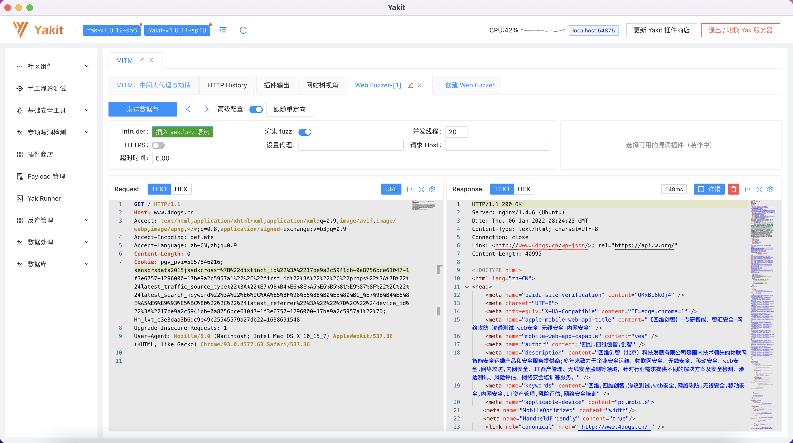
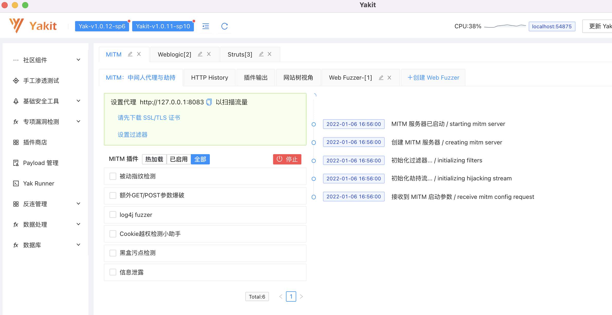
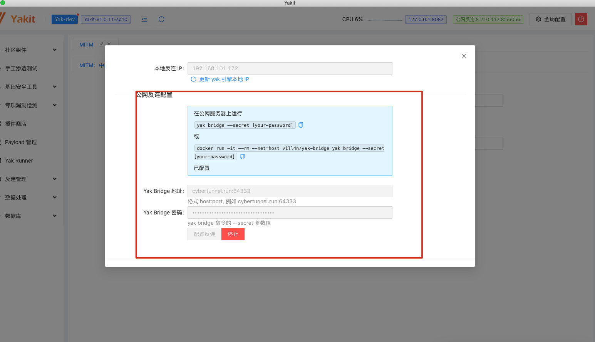
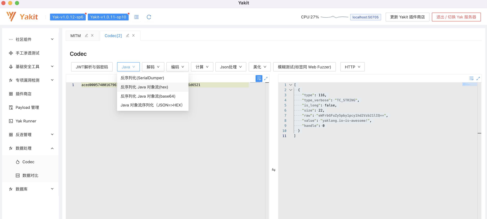

# YAKIT-网络安全单兵工具

## 免责声明

1. 本工具仅面向 **合法授权** 的企业安全建设行为与个人学习行为，如您需要测试本工具的可用性，请自行搭建靶机环境。

2. 在使用本工具进行检测时，您应确保该行为符合当地的法律法规，并且已经取得了足够的授权。请勿对非授权目标进行扫描。

3. 禁止对本软件实施逆向工程、反编译、试图破译源代码，植入后门传播恶意软件等行为。

**如果发现上述禁止行为，我们将保留追究您法律责任的权利。**

如您在使用本工具的过程中存在任何非法行为，您需自行承担相应后果，我们将不承担任何法律及连带责任。

在安装并使用本工具前，请您 **务必审慎阅读、充分理解各条款内容**

限制、免责条款或者其他涉及您重大权益的条款可能会以 **加粗**、加下划线等形式提示您重点注意。

除非您已充分阅读、完全理解并接受本协议所有条款，否则，请您不要安装并使用本工具。您的使用行为或者您以其他任何明示或者默示方式表示接受本协议的，即视为您已阅读并同意本协议的约束。

## 1. YAK语言简介

一群拥有丰富网络安全从业经验的工程师，对现有的通用编程语言感到不满——他们想要的是一个开源的语言，它要具备Golang的高并发执行能力；要像Python一样**语法简单**；要是个**脚本语言**，这样可以快速分发给同伴；要可以一次编写直接执行，而不要安装第三方库；要原生**具备网络安全专用能力**，如端口探测、SYN无状态扫描、Nmap的服务指纹，并以函数形式扩展提供；还有，它应该是**图灵完备**的，**易于学习**的……

所以，Yak 语言诞生了！

YAK是国际上首个为网络安全而生的“领域特定语言（Domain Specific Language）”，提供了非常强大的安全能力。Yak是绝大部分 “数据描述语言/容器语言” 的超集，宿主语言采用Golang，具备Go语言所有能力与库生态，具备自己的VSCode插件等。Yak语法可自定义，是一门图灵完备的脚本语言，完全**国产**。通过函数提供各类底层安全能力，包括端口扫描、指纹识别、poc框架、shell管理、MITM劫持、强大的插件系统等。

## 2. YAKIT单兵工具简介

Yakit是基于Yak语言开发的网络安全单兵工具，旨在打造一个覆盖渗透测试全流程的网络安全工具库。

受限于Yak使用形式，用户必须学习 Yak 语言并同时具备对安全的一定理解。为了让 Yak 本身的安全能力更容易被大家接受和使用，我们为Yak编写了gRPC服务器，并使用这个服务器构建了一个客户端：Yakit，通过界面化GUI的形式，降低大家使用Yak的门槛。


### 2.1 Burpsuite 的年轻中国挑战者

Burpsuite几乎成为全球WEB安全从业者必装的安全测试工具，然而十余年来尚无一个可替代的解决方案。破解版被投毒风险高、商业版太贵、插件难写、依赖java等等问题逐渐显露。我们团队基于yak顺手实现了BurpSuite的核心功能，期望给所有的从业者一个新的选择。完全替代并不是我们终极目标，替代并超越，切实降低门槛，提升从业者工作效率，才是我们的追求。

当前，我们已经实现了BurpSuite常用的功能，包括拦截并修改请求/返回报文、history模块、repeater模块、intruder模块，并且在我们的fuzz模块中创新性的实现了GUI标签fuzz，具备更好的可扩展性。

**HTTP History**：



**WEB Fuzzer:**



**被动漏洞检测系统：**




### 2.2 Poc/Exp超集

在实战安全测试过程中，我们经常面临一个需求，即已知对方使用了weblogic/struts2等，需要一键检测是否存在指定漏洞，然而这么简单的需求我们当下却要打开各种专用工具不停切换，甚至为了安装某个工具而不得不切换Windows/Linux，或者安装一堆复杂的依赖。在yakit上，我们将致力于提供一站式的解决方案，您只需要输入目标，点击开始检测按钮，即可快速得到结果。


为了快速提升poc的检测能力，我们在yak语言中原生集成了nuclei(MIT协议)，当然，在插件模块中，你可以基于yak/yaml编写各种你想要的检测能力，并将插件快速展示到左侧菜单栏中。**快来跟我们一起完善Yakit插件吧**

### 2.3 ”地表最强“的插件系统

作为一个单兵工具平台，自然离不开可快速扩展的插件系统。理论上一个带界面的插件，编写者需要对前端、后台都比较熟悉，这增大了开发者的进入门槛。与其他平台不同的是，我们在设计时，插件核心代码全部用yak实现，并且可以通过yakit库实现与界面的交互，除此之外，为了配得上”地表最强“，您还可以参考以下文章的描述：

[插件设计思路](https://www.yaklang.io/products/professional/yak-script-system)

[插件编写指南](https://www.yaklang.io/products/professional/yakit-plugin-how-to)


### 2.4 Teamserver设计

由于 Yak 核心引擎与 Yakit 的分离式安装，Yakit 仅仅作为一个客户端而存在，Yakit 的使用理所当然就应该存在两种模式。

1. 本地模式：默认启动一个随机端口的 `yak grpc` 服务器

2. 远程模式：

   ```
   yak grpc
   ```

   可以启动在任何平台 / 任何网络位置，包括

   * 远端托管主机 ECS/VPS

   * 本地个人 PC

   * 内网环境

除此以外，我们还创新性的加入了brige模式，可方便的将内网通过反弹模式映射到公网，在这种模式下，我们不在需要安装frp之类的端口转发工具，而是在一个GUI界面下，执行内网横向移动操作，极大的提升了测试效率。



### 2.5 原生的JAVA反序列化能力支持

在当下环境，我们要检测java反序列化漏洞，在生成payload阶段，我们通常需要借助[ysoserial](https://github.com/frohoff/ysoserial)，然而这种解决方案不仅需要安装java环境，还甚至需要安装指定版本的java才行。而yakit则使用yak原生实现了java反序列化协议的支持，如此一来，我们即可方便的通过编写yak脚本快速对目标进行测试。



该部分的使用详情请参见文章[”新年献礼：使用 Yakit 打破 Java 序列化协议语言隔离“](https://mp.weixin.qq.com/s/HdUARJFQu3WMWvvqs9VGyg )


## Stargazers over time

[](https://starchart.cc/yaklang/yakit)

## 3. 我们的目标

​	Yakit作为Burpsuite 的年轻中国挑战者，我们的第一个目标是，成为像Burpsuite一样有技术深度的产品，让Burpsuite的盗版用户能有一个更好、更安全的工具去选择和使用。但脚步却不仅仅停在这 里，我们的梦想是，成为安全领域的matlab，拥有强大且丰富的算法能力，成为安全领域的基座。
​	Yak和Yakit想做的从来不是像现在安全工具一样的孤岛，而是通过融合，为大家提供一个拥有强大且完备安全能力的产品。Yak和Yakit从开源到编写包含实战案例的安全研发教程，以及Yakit的个性自主化编辑，都在告诉大家一个理念，我们不单单只是想要为大家提供好用的工具，而是为了全面提升大家的安全能力，真正达到人与产品的共同进步。业内大多产品都强调傻瓜式的一键操作与结果可视化，这也是Yakit和Yak最大的不同，我们强调的是用户在操作中的参与感，在不断地学习中，像升级打怪一样，从小白用户蜕变成专业用户，实现国内安全从业人员的能力提升，形成自有的安全壁垒，这才是我们团队的终极目标。

## 4. 官网安装及使用教程

https://www.yaklang.io/docs/startup

## 5. 联系我们

如果对我们的产品有任何建设性意见或 BUG 反馈，欢迎大家提 issue

或通过微信公众号联系我们，也欢迎联系商业授权与合作

进交流群或有问题想与技术同学沟通，请联系并添加运营微信号：


公众号二维码：


